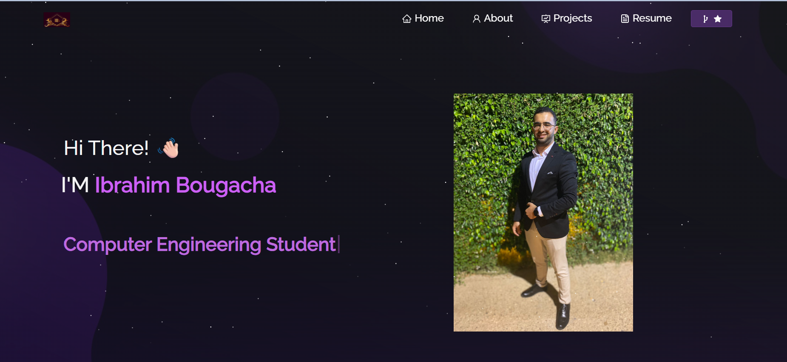

<h2 align="center">
  Mon Portfolio Personnel 
  <a href="https://portfolio-39c89.web.app" target="_blank">Voir le site en ligne</a>
</h2>

  

 

## TL;DR

Ce projet a été inspiré d’un template open-source, mais il a été entièrement personnalisé pour mes besoins personnels.

## Built With

My personal portfolio <a href="https://portfolio-39c89.web.app/" target="_blank">Ibrahim_Bougacha</a> which features some of my github projects as well as my resume and technical skills. 

This project was built using these technologies.

- React.js
- Node.js
- CSS3
- VsCode
- FireBase

## Features

**📖 Multi-Page Layout**

**🎨 Styled with React-Bootstrap and Css with easy to customize colors**

**📱 Fully Responsive**

## Getting Started

Clone down this repository. You will need `node.js` and `git` installed globally on your machine.

## 🛠 Installation and Setup Instructions

1. Installation: `npm install`

2. In the project directory, you can run: `npm start`

Runs the app in the development mode.\
Open [http://localhost:3000](http://localhost:3000) to view it in the browser.
The page will reload if you make edits.

## Usage Instructions

Open the project folder and Navigate to `/src/components/`.  
You will find all the components used and you can edit your information accordingly.

### Show your support

Give a ⭐ if you like this website!